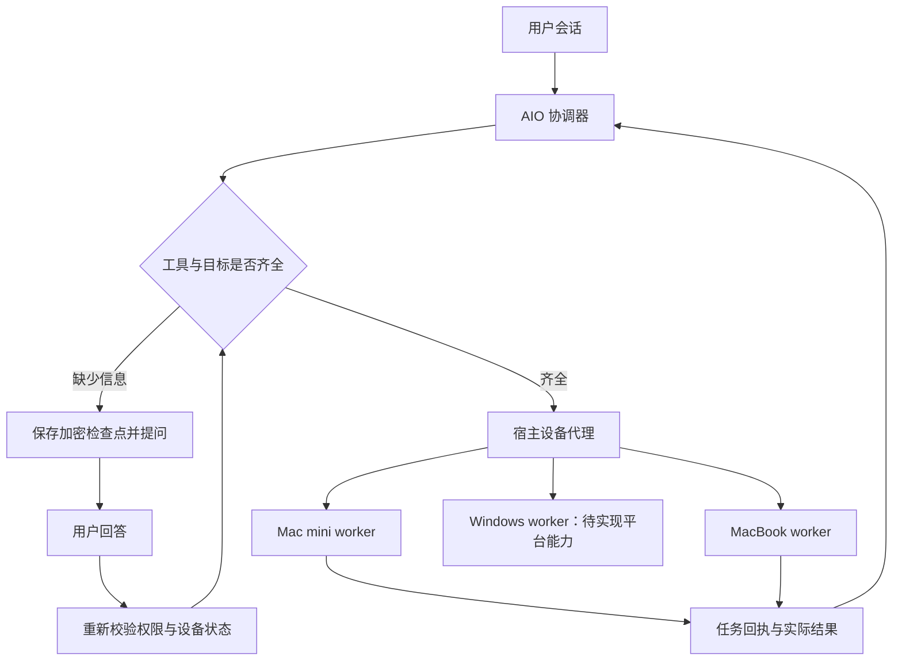

# 多设备执行与用户输入中断

## 当前能力与缺口

配对、任务通道、工具实现、智能体调度是四个独立层次。设备在线只证明通道可用。当前设备端声明的 `desktop.open-app` 可启动应用并回报实际 PID；它不能创建 WPS 工作簿、编辑单元格，也不是任意文件或桌面控制权限。Agent 目前是中心协调器，配对客户端是工具执行 worker；尚未实现每台设备独立运行模型的蜂群。

本次实现：会话设备选择、服务端目标校验、`request_user_input` 结构化提问、持久化暂停与恢复。一次提问支持 1 至 3 题，选项或自由文本。等待期间释放生成任务及并发配额，不占着模型连接。没有默认超时替用户作答。



## 设备选择规则

1. 本次用户消息明确点名的设备优先；名称匹配有歧义则询问，不让模型的 `worker_id` 参数替用户选择。
2. 否则使用会话顶部“执行设备”中选定的设备。
3. 没有选定目标且只有一台获授权的在线设备时可自动选择。
4. 有多台时在派发前保存问题，用户选择会成为本会话的目标。此目标不是扩大权限的凭据。
5. 目标离线、被撤销或不再有能力时停止派发，不故障转移到别的电脑。用户可在会话菜单重新选择。

`device_open_application` 的执行入口强制应用这些规则。宿主继续核验租户、用户、插件授权及设备能力。客户端也继续执行本地授权目录/能力限制。上述检查不依赖模型遵守提示词。

## 中断与恢复

模型工具调用 `request_user_input`，或设备路由发现歧义时，执行器发送 `Delta::Waiting`。检查点包含已完成的工具结果、尚未执行的工具调用、剩余模型轮数和 token 计数。后端在同一数据库事务中保存加密检查点并将消息标记为 `awaiting_input`。

答案通过 `POST /conversations/{id}/input` 提交，绑定问题 UUID、会话、当前租户和当前用户。后端验证题目完整性、选项值、当前模型访问权限和当前设备授权，再将答案注入原工具结果或重新执行设备选择校验。先前完成的工具不会重跑。

- 刷新浏览器及服务重启保留待答问题。
- 同一问题重送相同答案返回现有结果；不同答案返回冲突。
- 取消任务令待答问题失效，迟到答案不能唤醒任务。
- 真正开始恢复后若进程崩溃，仍沿用 `interrupted` 状态；不自动重放可能已产生副作用的操作。
- 工具能力被移除后，恢复不能绕过权限。
- 用户回答不是账号密码输入框，不应在这里收集秘密。

这是 agent loop 的 human-in-the-loop interrupt / elicitation。它与执行审批不同：前者补齐设备、路径等参数，后者授予操作权限。参考 [Codex App Server 的用户输入与 elicitation 协议](https://learn.chatgpt.com/docs/app-server)。AIO 独立实现自己的持久化状态机，不依赖 Codex 服务端。

## Windows 与 dotfiles

目前个人配置实现覆盖 macOS/Linux 的相对 home 路径，命令启动器为 macOS bundle ID。没有验证 Windows worker 安装、自启动、原子文件替换、权限或配置同步，不应标成 Windows 已支持。

跨平台扩展应保存逻辑配置标识和目标映射，不能同步机器绝对路径。例如：

| 逻辑配置 | macOS | Windows |
| --- | --- | --- |
| Git 用户配置 | home/.gitconfig | home/.gitconfig |
| 应用配置 | 该应用在 macOS 声明的目录 | appData 或 localAppData 下该应用目录 |
| shell 启动配置 | zsh/bash 对应文件 | PowerShell profile 或指定 shell 文件 |
| 打开 QQ | 应用 bundle ID | 安装发现后的应用 ID/可执行路径 |

worker 在本机解析 `home/config/appData/localAppData` 等根目录，并上报支持的逻辑目标；AIO 只保存跨平台内容和 OS/设备覆盖层。Windows 环境变量与 PATH 必须使用其原生持久化接口；不能把 `export` 和冒号分隔 PATH 直接复制过去。凭据继续使用各设备本地保护存储。此为后续平台适配契约，本次没有仅通过放开 `win32` 字符串来宣称支持。

## 蜂群扩展边界

一个会话可以由协调器拆成多个子任务，但每个子任务必须绑定 `agentId/taskId/deviceId/capability/workspace`。真正的设备 agent 还需要自己的模型上下文、执行预算、取消句柄和工具策略，不能将在线 worker 数量当作 agent 数量。

子任务遇到信息缺口时应交给会话协调器统一提问；相同问题合并，一次展示 1 至 3 题。依赖答案的分支暂停，互不依赖的分支可继续。答案按问题和子任务 ID 恢复原分支。当前实现按会话暂停单个 loop。独立工作区批次已经实现并发派发、结果等待及取消，见 [独立任务蜂群](swarm-execution.md)；DAG 和各设备独立模型上下文仍未实现。

## 验证入口

- `engine/src/input_tests.rs`：序列化检查点后恢复，前后工具各执行一次。
- `backend/src/generated/conversation/input_tests.rs`：真实隔离 PostgreSQL、服务重启、租户/用户隔离、离线、无效答案、取消及幂等提交。
- `scripts/test-input-browser.mjs`：实际 wasm + 后端 + PostgreSQL，桌面和手机的问题窗口、刷新与提交。
- 桌面执行器和模型网关在测试中由 fixture 替代；不能把这些测试当成物理 Mac mini / Windows 或真实 WPS 编辑验收。

隔离验收示例（数据库必须为可丢弃的开发实例）：

```sh
AIO_TEST_DATABASE_URL=postgresql://worker_test@127.0.0.1:25479/postgres \
  AIO_AGENT_DEV_DIRECTORY=/tmp/aio-input-dev node scripts/setup-dev.mjs
cargo test -p az-agent-engine -p az-agent-server
# 先执行 dx build 和 scripts/package-frontend.mjs，再运行带真实浏览器的服务测试。
AIO_INPUT_BROWSER=1 AIO_INPUT_TEST_CONFIG=/tmp/aio-input-dev/runtime.json \
  cargo test -p az-agent-server durable_device_question -- --ignored
```

本次验证：执行器 4 项与服务端 12 项通过（含真实 PostgreSQL 的重启恢复、两题往返）；wasm 检查及 release 构建通过；1440×900、390×844 实际浏览器页面通过，无横向溢出。协议验收采用模拟模型与模拟设备执行器，没有调用收费推理，也没有将 Windows/WPS 当成通过项目。
