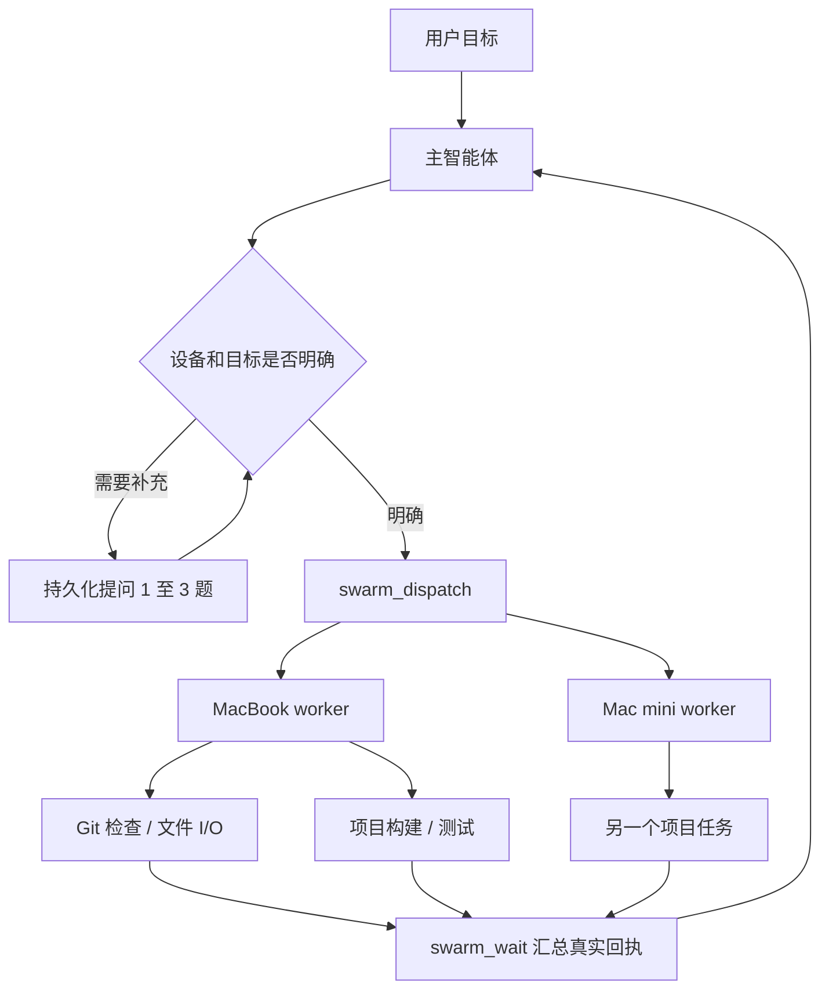

# 独立任务蜂群

主智能体决定目标、拆分任务和验收；简单的 Git、文件与项目命令由设备 worker 执行，不再额外调用一个模型来运行固定命令。每台设备保持自己的出站连接、设备凭据和本机工作区授权。绑定信息为会话、回复、设备、工作区和作业 ID，设备在线不会自动授予整个文件系统。



## 已实现协议

- `device_list` 发现当前账号已获授权的设备及能力。
- `swarm_dispatch` 每次 1 至 4 组，每组一个设备，先 `input:{action:"describe"}` 读取工作区逻辑 ID 与允许的命令，再用 `input:{action:"run",jobs:[...]}` 执行最多 8 项独立作业。所有目标在派发前完成校验；模型提供的设备名必须来自当前用户消息或会话已选设备。未明确目标的多设备情形使用既有持久化选择问题。
- 每台 worker 的单批最多并行 3 个不重叠的真实工作区；相同目录、别名、父子目录串行；输入顺序决定回执顺序。现有设备领取协议一次领取一个批次，不破坏租约与崩溃去重机制。多个设备的批次可以并行。
- `swarm_wait` 每次查询最多 4 个会话任务，最多等待 20 秒；终态回执加密缓存，重新加载或 Agent 重启后仍可查询。重复派发相同回复、设备、输入会复用同一 ID；未知结果不自动重放。
- `swarm_cancel`、会话停止和结果窗口的“停止任务”向宿主发送取消。在线 worker 在下一次续约时终止执行（通常 20 秒内）；断网受 110 秒本机租约预算约束。已经写入的文件不会因停止自动回滚。
- “蜂群任务”窗口展示最近 32 个批次，展开可看每项状态、真实退出码、有限日志及文件 hash。过长输出明确截断，不将排队、运行或未知状态报告为成功。

任务关联只在 Agent 自己的数据空间保存；宿主任务按租户和用户隔离。能力由插件清单、宿主配置、设备启用和本机目录授权共同约束。撤销账号、设备或目录授权不会自动把任务迁移到另一设备。

## 作业边界

| 作业 | 输入及结果 | 并发边界 |
| --- | --- | --- |
| `git.status / git.diff / git.log` | 固定只读命令，返回退出码与有限文本 | 同工作区串行；没有自动 commit、push、merge 或 reset |
| `fs.read` | 工作区 ID、相对路径；返回内容与 hash | 禁止链接、隐藏路径和已识别凭据路径 |
| `fs.write` | 内容与预期 hash，新文件用 null；原子替换前再次比较并备份 | 必须本机注册写权限；外部编辑冲突交回主智能体 |
| `project.run` | 本机登记的命令名；返回退出码、stdout/stderr、耗时、超时与取消状态 | 必须本机注册执行权限；最多 10 分钟，进程组在结束后清理 |

项目命令可以把启动服务、请求健康地址、验收页面或 API、关闭服务组合成一个明确的 smoke/e2e 命令。worker 运行该命令并提供证据。长期驻留的开发服务器目前不作为成功结束的任务托管；它需要独立的进程会话模型。普通项目命令具有本机账号权限，不是 OS 沙箱；命令 manifest 位于工作区之外，以 0600 保存并在本机注册时固定，模型不能远程替换 argv/env。

## 使用示例

```json
{
  "groups": [
    {"device":"MacBook","label":"前端验收","input":{"action":"run","jobs":[
      {"id":"changes","workspace":"web","operation":"git.status"},
      {"id":"test","workspace":"web","operation":"project.run","command":"test"}
    ]}},
    {"device":"Mac mini","label":"服务构建","input":{"action":"run","jobs":[
      {"id":"build","workspace":"server","operation":"project.run","command":"build"}
    ]}}
  ]
}
```

设备名称来自用户当前要求。不要把有前后依赖的跨目录作业塞进一个独立批次：先等上游通过，再发下一轮。已有同目录串行只用于防止覆盖，不代表失败会自动跳过后续作业。

## 后续真正的子智能体

当前实现是主智能体加分布式工具执行。还未实现每台设备独立模型上下文、自动递归派生、DAG 依赖传播或后台持续自动修复。下一层应在现有任务 ID 上增加独立上下文、模型/预算、工作区或 worktree 所有权、验收条件和受限重试；执行者遇到未定设计时向协调器提交结构化问题。协调器合并重复问题，暂停依赖分支，其他分支继续。提交、推送和合并须匹配用户授权，不由“修复项目”几个字直接放开所有 Git 写操作。

本机映射目前实现 macOS/Linux。Windows 的目录根、环境变量、进程取消和文件替换仍需原生适配与真实验收，不通过放开平台字符串宣称支持。

## 验收

客户端全套 37 项、工作区聚焦 10 项（最终失败映射后重跑）、真实双项目 harness 9 项通过；其中有实际 HTTP 200 响应、文件 hash/备份、退出码 7 和子进程退出证明。宿主 3 项真实隔离 PostgreSQL 测试覆盖设备授权、租户/用户隔离、取消和能力交集。Agent 的持久派发测试验证并发、幂等、加密回执、跨账号拒绝和重启保留。真实 wasm + 后端 + PostgreSQL 的桌面 1440×900、手机 390×844 页面验证刷新保留与失败展示，无横向溢出或控制台错误。

这些隔离测试中的设备路由和模型是 fixture；它们不等于多台物理设备、生产自然语言模型调用或 Windows 验收。发布后应另记实际设备与账号链路的证据。
